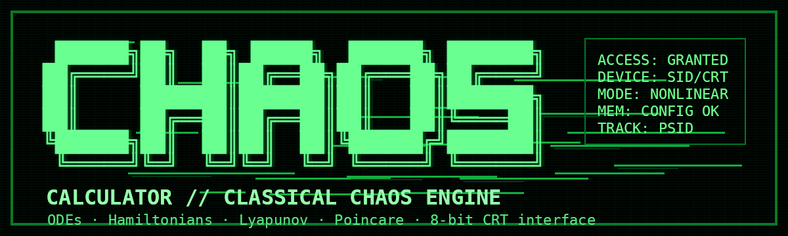
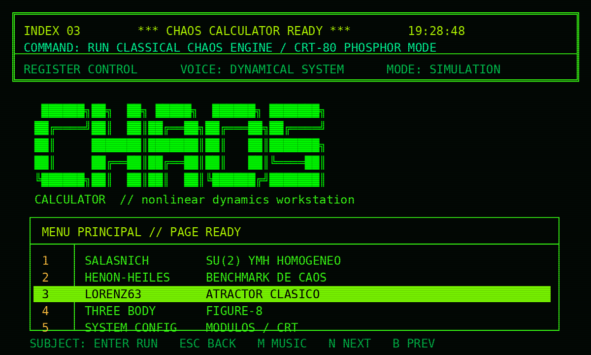
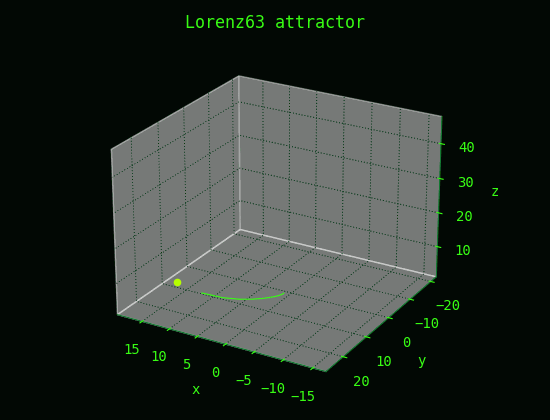
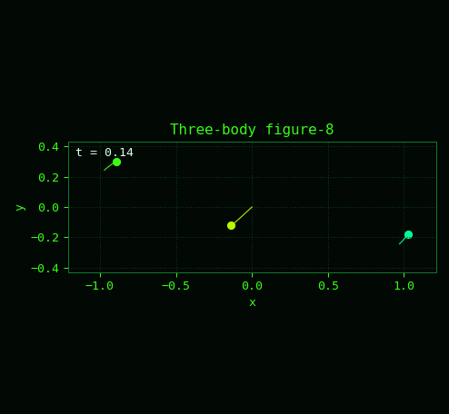
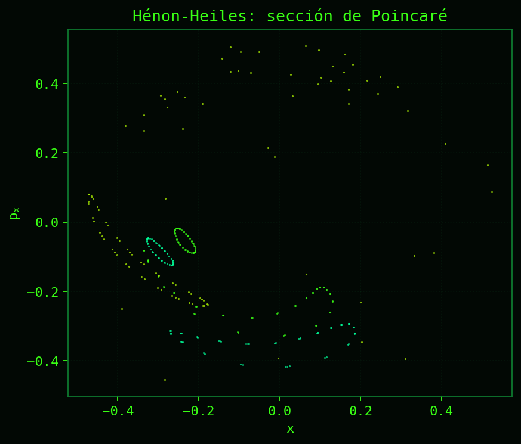
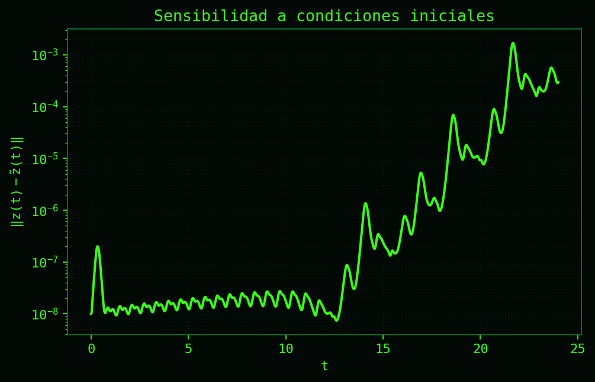
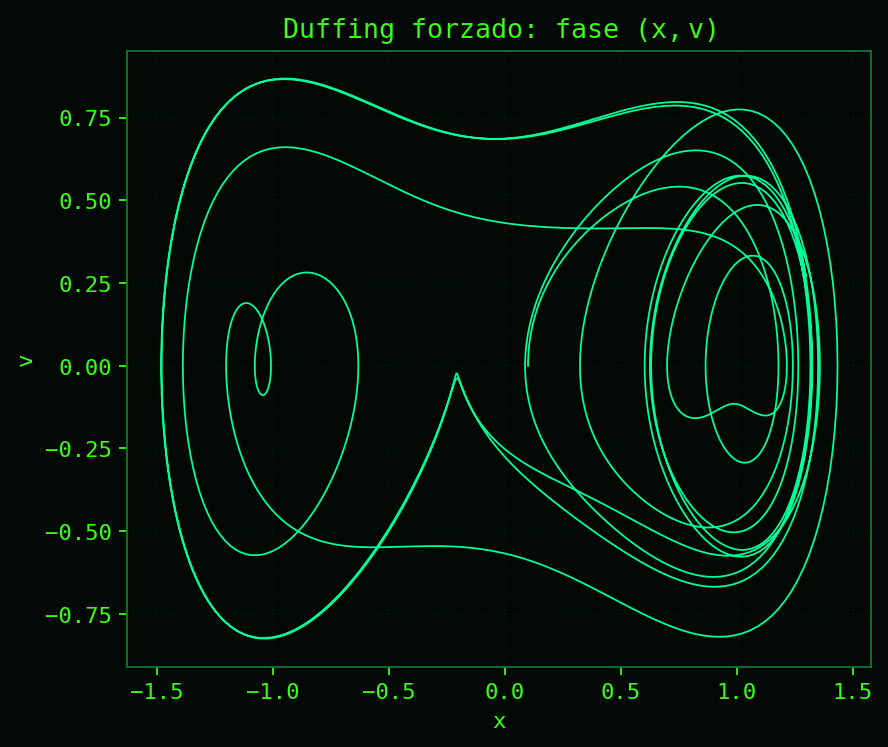

<p align="center">
  
</p>

<p align="center">
  <b>Classical chaos analyzer · CRT-80 terminal skin · Hamiltonians + arbitrary ODEs · SID soundtrack</b>
</p>

<p align="center">
  
  
  
  
</p>

<p align="center">
  
</p>

---

## Qué es esto

**Chaos Calculator 8-bit** es una calculadora de caos clásico con pinta de terminal CRT vieja. La idea es simple: cargar un sistema dinámico, integrar, mirar su trayectoria, comparar sensibilidad a condiciones iniciales, calcular indicadores de caos y exportar figuras decentes sin tener que escribir todo desde cero cada vez.

No es un paquete “cerrado” ni una app formal. Es más bien un laboratorio personal para sistemas no lineales: suficientemente cómodo para jugar, suficientemente serio para generar primeras figuras y suficientemente verde como para parecer que salió de una terminal perdida de 1987.

---

## Demo visual

| Lorenz63 | Three-body figure-8 |
|---|---|
|  |  |
| Atractor de Lorenz renderizado como trayectoria 3D. | Coreografía newtoniana de tres cuerpos con masas iguales. |

| Poincaré | Sensibilidad | Duffing |
|---|---|---|
|  |  |  |
| Sección de Poincaré para Hénon-Heiles. | Separación entre dos condiciones iniciales casi iguales. | Fase \((x,v)\) del Duffing forzado. |

---

## Qué puede analizar

El programa trabaja con dos familias grandes:

1. **Hamiltonianos clásicos**  
   Escribes \(H(q,p)\) y el motor construye automáticamente las ecuaciones de Hamilton.

2. **ODEs generales**  
   Escribes un sistema autónomo de la forma

   ```text
   z' = f(z)
   ```

   y el programa lo integra como sistema dinámico general.

Actualmente incluye presets para:

| Preset | Tipo | Comentario |
|---|---:|---|
| Salasnich | Hamiltoniano | Reducción homogénea SU(2) Yang-Mills-Higgs. |
| Canfora | Hamiltoniano | Modelo reducido tipo Georgi-Glashow. |
| Hénon-Heiles | Hamiltoniano | Benchmark clásico para caos Hamiltoniano. |
| Three-body figure-8 | ODE | Tres cuerpos newtonianos planares con coreografía figura-8. |
| Lorenz63 | ODE | El atractor clásico de Lorenz. |
| Rössler | ODE | Otro atractor clásico de baja dimensión. |
| Duffing forzado | ODE | Oscilador no lineal forzado, autonomizado con fase. |
| Chua circuit | ODE | Circuito no lineal con dinámica caótica. |
| Péndulo doble | ODE | El clásico sistema mecánico sensible a condiciones iniciales. |

---

## Indicadores y salidas

- Trayectorias 2D/3D.
- Proyecciones de fase.
- Secciones de Poincaré.
- FTLE.
- SALI.
- Espectro de Lyapunov.
- Barridos de energía para Hamiltonianos.
- Animaciones GIF.
- Exportación en `png`, `svg` y `pdf`.
- Memoria persistente en `data/config.json`.

El motor tiene una función de **condiciones iniciales aleatorias inteligentes**: no tira números al azar sin más, sino que intenta respetar cotas, evitar singularidades, evitar colisiones en N-cuerpos y descartar estados que explotan inmediatamente.

---

## Instalación

Clona el repositorio:

```bash
git clone https://github.com/jrosasep/chaos-calculator-8bit.git
cd chaos-calculator-8bit
```

Instala dependencias:

```bash
pip install -r requirements.txt
```

Ejecuta:

```bash
python ChaosCalculator.py
```

En Windows conviene usar Windows Terminal. Si el audio SID no suena, revisa que exista:

```text
media/sidplayfp.exe
```

---

## Controles

```text
↑/↓       mover selección
ENTER     ejecutar opción
ESC       volver
M         música ON/OFF
N         siguiente pista SID
B         pista SID anterior
```

El programa recuerda tus cambios. Si ajustas resolución, estilo de Matplotlib, pista de audio, formatos de exportación o perfiles de rendimiento, queda guardado en:

```text
data/config.json
```

---

## Perfiles de rendimiento

Hay perfiles para no destruir el computador por accidente:

| Perfil | Uso sugerido |
|---|---|
| SAFE / RÁPIDO | Probar si el sistema funciona. |
| NORMAL / EQUILIBRADO | Uso diario. |
| HIGH / PUBLICACIÓN | Figuras más densas y más bonitas. |
| ULTRA / COSTO ALTO | Para cuando de verdad quieres esperar. |

Algunas cosas en caos clásico escalan feo: muchos cruces de Poincaré, espectros de Lyapunov largos, animaciones en GIF y barridos de energía pueden demorarse bastante. El programa intenta avisar antes de hacer locuras.

---

## Notebook

También viene un notebook:

```text
ChaosCalculator_Motor.ipynb
```

Ese archivo sirve para usar el motor sin la interfaz CRT. Es la forma más cómoda de modificar parámetros, revisar el código con calma, probar condiciones iniciales y graficar sin navegar menús.

---

## Estructura

```text
ChaosCalculator/
├── ChaosCalculator.py              # launcher principal
├── ChaosCalculator_Motor.ipynb      # notebook para usar el motor directamente
├── README.md
├── requirements.txt
├── .gitignore
├── engine/
│   └── chaos_runtime.py             # motor + interfaz CRT
├── media/
│   ├── chaos_logo_crt.png
│   ├── readme_assets/
│   ├── I_Feel_Love.sid
│   ├── Ashes_to_Ashes.sid
│   └── sidplayfp.exe
└── data/
    └── .gitkeep                     # aquí se crean config, logs y figuras
```

Sí, está compacto a propósito. Más carpetas de las necesarias solo hacen que uno termine peleando con el proyecto en vez de mirar la física.

---

## Música

Solo dejé dos temas SID:

```text
I_Feel_Love.sid
Ashes_to_Ashes.sid
```

Se reproducen con `sidplayfp.exe`. El programa intenta cerrar el reproductor junto con Python. Si Windows mata el proceso de forma abrupta, el siguiente arranque intenta limpiar el audio residual.

---

## Archivos generados

Todo lo generado cae dentro de `data/`:

```text
data/config.json          # memoria del programa
data/logs/                # logs mínimos
data/figuras_caos/        # figuras, gifs, csv, etc.
```

Eso está ignorado por Git porque son salidas de trabajo, no código fuente.

---

## Nota honesta

Esto es experimental. Sirve para explorar, visualizar y orientarse. No reemplaza una validación numérica seria ni una revisión matemática completa. Si una figura se ve demasiado bonita, todavía hay que preguntarse si el paso temporal, la tolerancia, el tiempo de integración y la condición inicial tienen sentido.

---

## Nombre sugerido

```text
chaos-calculator-8bit
```

Corto, buscable y dice exactamente qué es: una calculadora de caos con estética 8-bit.
