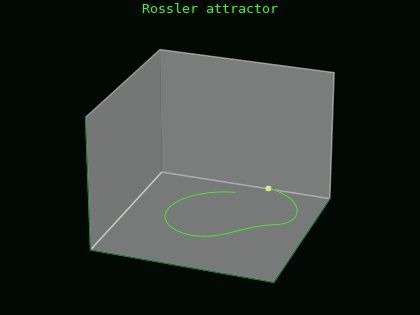
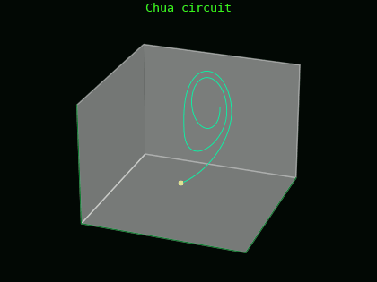
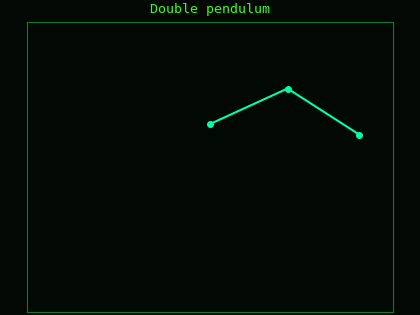
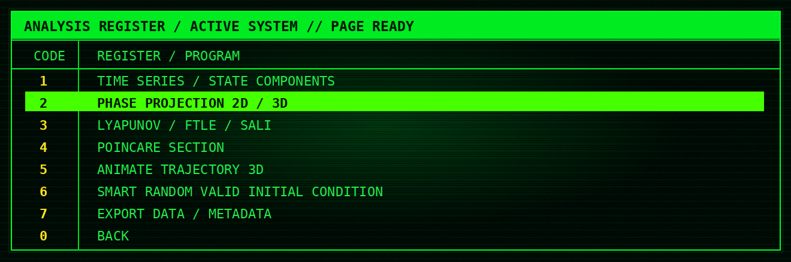
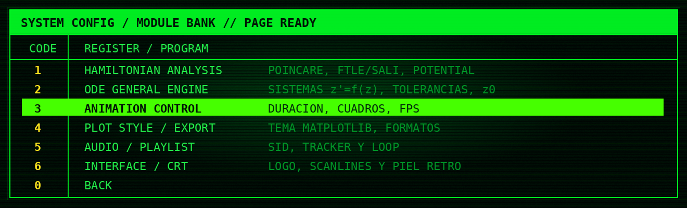

<p align="center">
  
</p>

 ## Qué es esto

**Chaos Calculator** es una calculadora experimental de caos clásico con estética de terminal CRT vieja, sacada de Pinterest; véase https://cl.pinterest.com/pin/689543392987246924/. Sirve para cargar sistemas dinámicos, integrarlos, visualizar trayectorias, comparar sensibilidad a condiciones iniciales, calcular indicadores de caos y exportar figuras sin escribir todo desde cero. Fue generado mediante iteraciones de prompts en Claude Pro y ChatGPT Plus como laboratorio personal para sistemas no lineales.

---

## Demo visual

| Lorenz63 | Three-body figure-8 |
|---|---|
|  |  |
| Atractor de Lorenz renderizado como trayectoria 3D. | Coreografía newtoniana de tres cuerpos con masas iguales. |

| Rössler | Chua | Péndulo doble |
|---|---|---|
|  |  |  |
| Atractor de Rössler. | Circuito de Chua. | Péndulo doble con traza. |

| Poincaré | Sensibilidad | Duffing |
|---|---|---|
|  |  |  |
| Sección de Poincaré para Hénon-Heiles. | Separación entre dos condiciones iniciales casi iguales. | Fase \((x,v)\) del Duffing forzado. |

---

## Interfaz

La interfaz está pensada para que el programa se use desde menús, no desde comandos sueltos. En el **menú de análisis** se ejecutan las rutinas principales del sistema activo: series temporales, proyecciones de fase, FTLE/SALI, secciones de Poincaré, animaciones 3D, condiciones iniciales aleatorias inteligentes y exportación de datos.

<p align="center">
  
</p>

El **menú de configuración** está separado por módulos para no mostrar todos los parámetros al mismo tiempo. Desde ahí se ajustan tolerancias numéricas, resolución, número de cruces de Poincaré, frames/FPS de animaciones, perfiles de rendimiento, audio, formatos de exportación y los temas globales de Matplotlib usados en las figuras.

<p align="center">
  
</p>

Los cambios quedan guardados en `data/config.json`, así que el programa recuerda tus preferencias entre sesiones.

---

## Qué puede analizar

El programa trabaja con dos familias grandes:

1. **Hamiltonianos clásicos**  
   Escribes \(H(q,p)\) y el motor construye automáticamente las ecuaciones de Hamilton.

2. **ODEs generales**  
   Escribes un sistema autónomo de la forma

   ```text
   z' = f(z)
   ```

   y el programa lo integra como sistema dinámico general.

Actualmente incluye presets para:

| Preset | Tipo | Comentario |
|---|---:|---|
| Salasnich | Hamiltoniano | Reducción homogénea SU(2) Yang-Mills-Higgs. |
| Canfora | Hamiltoniano | Modelo reducido tipo Georgi-Glashow. |
| Hénon-Heiles | Hamiltoniano | Benchmark clásico para caos Hamiltoniano. |
| Three-body figure-8 | ODE | Tres cuerpos newtonianos planares con coreografía figura-8. |
| Lorenz63 | ODE | El atractor clásico de Lorenz. |
| Rössler | ODE | Otro atractor clásico de baja dimensión. |
| Duffing forzado | ODE | Oscilador no lineal forzado, autonomizado con fase. |
| Chua circuit | ODE | Circuito no lineal con dinámica caótica. |
| Péndulo doble | ODE | El clásico sistema mecánico sensible a condiciones iniciales. |

---

## Indicadores y salidas

- Trayectorias 2D/3D.
- Proyecciones de fase.
- Secciones de Poincaré.
- FTLE.
- SALI.
- Espectro de Lyapunov.
- Barridos de energía para Hamiltonianos.
- Animaciones GIF.
- Exportación en `png`, `svg` y `pdf`.
- Memoria persistente en `data/config.json`.

El motor tiene una función de **condiciones iniciales aleatorias inteligentes**: no tira números al azar sin más, sino que intenta respetar cotas, evitar singularidades, evitar colisiones en N-cuerpos y descartar estados que explotan inmediatamente.

---

## Instalación

Clona el repositorio:

```bash
git clone https://github.com/jrosasep/chaos-calculator.git
cd chaos-calculator
```

Instala dependencias:

```bash
pip install -r requirements.txt
```

Ejecuta:

```bash
python ChaosCalculator.py
```

En Windows conviene usar Windows Terminal. Si el audio SID no suena, revisa que exista:

```text
media/sidplayfp.exe
```

---

## Controles

```text
↑/↓       mover selección
ENTER     ejecutar opción
ESC       volver
M         música ON/OFF
N         siguiente pista SID
B         pista SID anterior
```

El programa recuerda tus cambios. Si ajustas resolución, estilo de Matplotlib, pista de audio, formatos de exportación o perfiles de rendimiento, queda guardado en:

```text
data/config.json
```

---

## Perfiles de rendimiento

Hay perfiles para no destruir el computador por accidente:

| Perfil               | Uso sugerido                           |
| -------------------- | -------------------------------------- |
| SAFE / RÁPIDO        | Probar si el sistema funciona.         |
| NORMAL / EQUILIBRADO | Uso diario.                            |
| HIGH / PUBLICACIÓN   | Figuras más densas y más bonitas.      |
| ULTRA / COSTO ALTO   | Para cuando de verdad quieres esperar. |

El programa intenta avisar que el tiempo de cómputo de los gráficos aumenta según la modificación de los parámetros de los cálculos; sin embargo, en próximas actualizaciones pretendo añadir funcionalidades más inteligentes para generar figuras espectaculares de forma más optimizada.

---

## Notebook

Incluye un archivo Jupyter Notebook para revisar las principales funcionalidades del motor, saltándose la parafernalia 8-bit de la interfaz de usuario del programa.

```text
ChaosCalculator_Motor.ipynb
```

---

## Estructura

```text
ChaosCalculator/
├── ChaosCalculator.py              # launcher principal
├── ChaosCalculator_Motor.ipynb      # notebook para usar el motor directamente
├── README.md
├── requirements.txt
├── .gitignore
├── engine/
│   └── chaos_runtime.py             # motor + interfaz CRT
├── media/
│   ├── chaos_logo_crt.png
│   ├── readme_assets/
│   ├── I_Feel_Love.sid
│   ├── Ashes_to_Ashes.sid
│   └── sidplayfp.exe
└── data/
    └── .gitkeep                     # aquí se crean config, logs y figuras
```

---

## Música

El programa cuenta con un “chip de audio” inspirado en la Commodore 64: usa `sidplayfp.exe` para reproducir archivos `.sid`. Agregué estos temas porque quería que el programa tuviera algo del estilo de los cracktros/keygens de los 2000s, pero con un aire todavía más retro. Eventualmente ampliaré la lista de reproducción.

Los temas incluidos son:

```text
I_Feel_Love.sid
Ashes_to_Ashes.sid
```

---

## Archivos generados

Todo lo generado cae dentro de `data/`:

```text
data/config.json          # memoria del programa
data/logs/                # logs mínimos
data/figuras_caos/        # figuras, gifs, csv, etc.
```

---

## Social preview

Para configurar la imagen social del repositorio en GitHub, usa:

```text
media/readme_assets/social_preview.png
```

---

## Nota honesta

Esto es experimental. Sirve para explorar, visualizar y orientarse. No reemplaza una validación numérica seria ni una revisión matemática completa. Si una figura se ve demasiado bonita, todavía hay que preguntarse si el paso temporal, la tolerancia, el tiempo de integración y la condición inicial tienen sentido.
